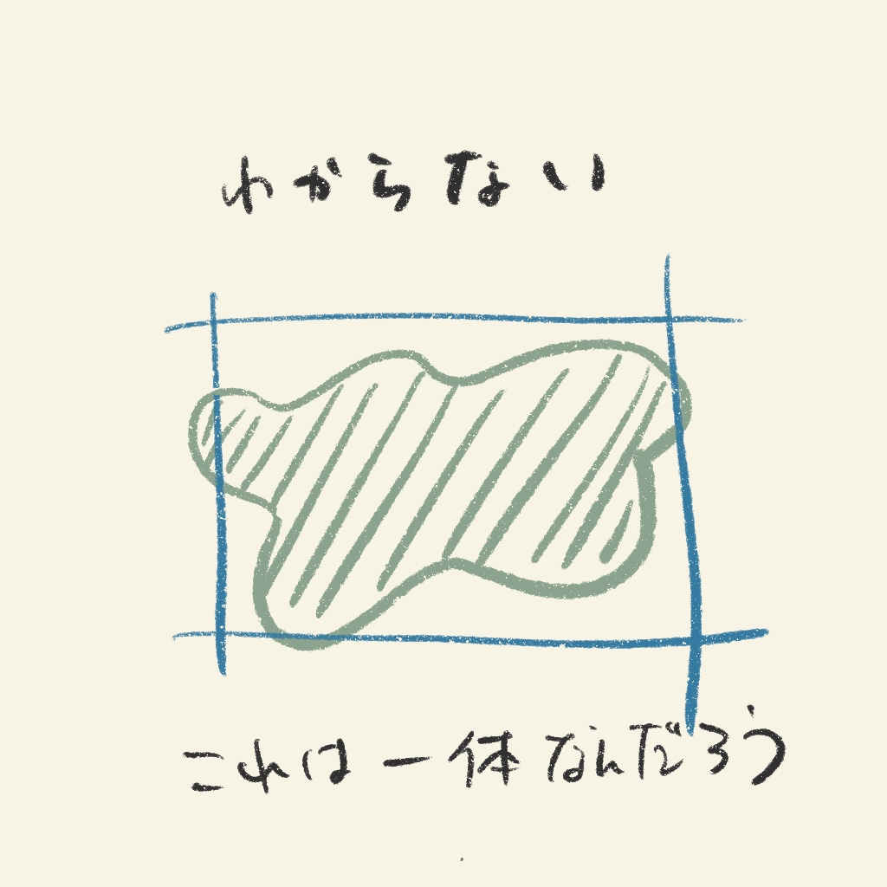
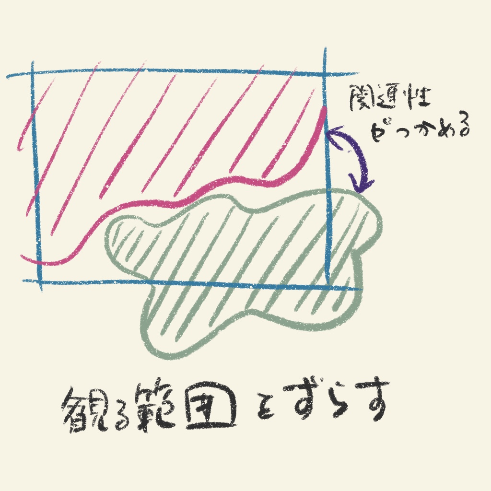
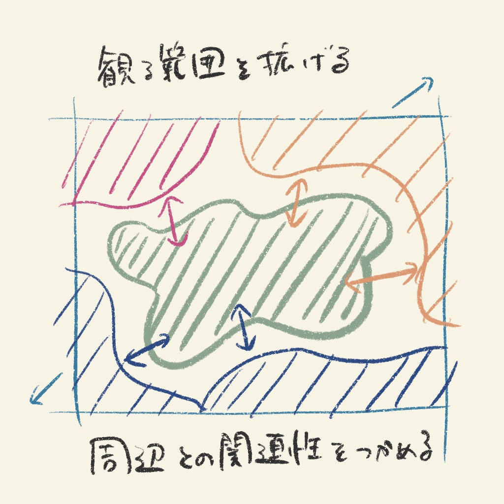
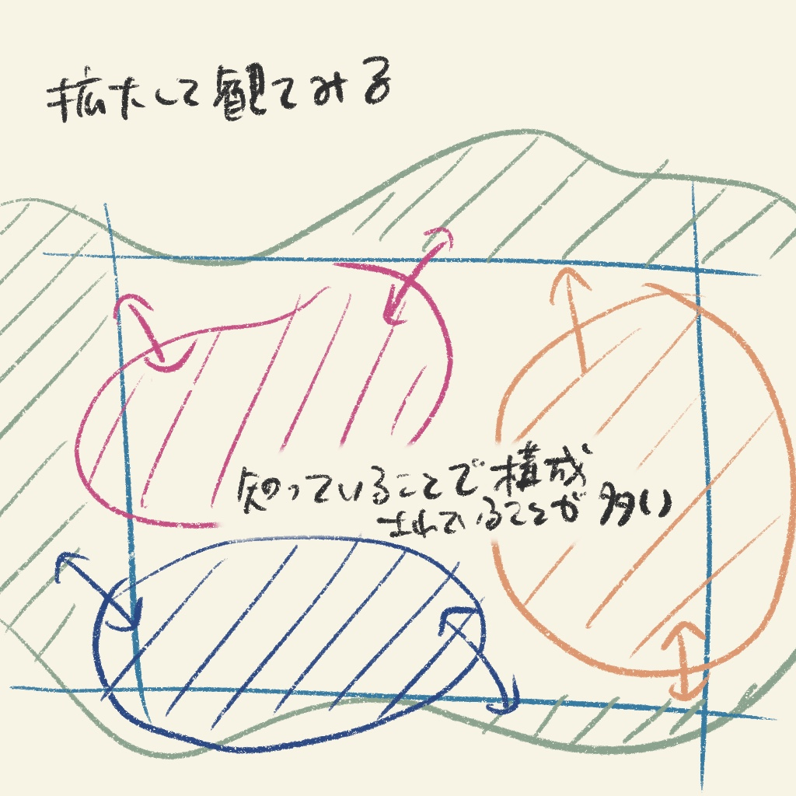

## 「わかる」？

「わかる」ということはどういうことだろう。
どういう時に「わかる」のか。

「わかる」とは **対象の解像度が上がり見えている範囲の像がはっきりと認識できること** だと考えている。反面、「わからない」とはどういう状況だろうか。

- 新しい知識・情報を仕入れているとき
- 人の話している内容が理解できない
- 等々...

対象の解像度が**ぼやけている時**「わからない」といえるだろう。

何かを理解する・把握する・明確にする時、私達は固定した（無意識によって固定された）視点を対象に持つ。この固定された視野の大部分がぼやけていると観ている範囲が何か「わからない」のである。

この「わからない」を「わかる」ためにはどういう作用があると「わかる」ようになるのか。

私は人に説明する際、「対象を観る範囲や絞りを変えることで『わからない』と『わかる』境界線を把握すること」と答えている。

よく物事を考える際に「視点を変える」という言葉を耳にするが、具体的には恣意的に「視点をずらす」「視野のピント調整を行う」ことを指していると解釈している。

### 観る範囲をずらす
「わからない」時はただ固定された一つの画を観ている時が多い。  
大部分がぼやけている画を観ていてもただそこに立ちつすくだけで何も得ることはないだろう。

画はそこから動かないからである。

そこで、観る範囲を変える。例えば観ている画の右下の部分が何やらぼやけている。では、右下の周りを画の中心として同じ範囲の画をして観てみよう。すると、「わからない」部分が中央にくると、その周りは実は解像度が明確な場合がある。そうなると、「わからない」部分がだんだん明確に浮き上がってくる。

それは、文章であるなら単純に単語の意味を知らないだけだったのかもしれないし、  
体系的な事象であれば理解が抜け落ちていた範囲なのかもしれない。

「わからない」印象は「わからない」範囲を観続けることで、自分が「わからない」と思い込む様になる。

すべてが「わからない」訳でもないし、すべてを「わかる」こともできないが、「わからない」を含んでいる視野をずらすことで、もともと「わかっていた」こととの関係性を、「わかる - わからない」の境界線を認識できるようになる。

### カメラの様にピントを調節する
観る対象の範囲をずらしてみるという話をした。  
ただ、世の中の物事は観る範囲をずらすだけでは「わからない」ことがたくさんある。そこで、今度はある範囲を拡大したり、縮小したりしてみる。

なんとなく今「わからない」画を観ている。この場合自分がよくやることとするのは「引いて観る」「拡大して観る」である。

「引いて観る」は視野の範囲をずらすことに似ているが、観測する対象の範囲を視点をずらさず広げてみるのである。

「わからない」範囲が引いて観ることで、ありふれた「わかる」の中の一点だけだったりすることもある。

同様に「拡大して観る」も「わからない」と認識している範囲のさらに狭い範囲にピントを合わせてみることで、実は「わかっている」ことがいくつも存在していることを認識できたりする。

### 前に進むために
「わからない」という状態は、意外にその「わからない」かもと思っている自分自身を許容してしまう連鎖にある。

「わからない」とはただその状態があるわけではなく、「恐怖」「苛立ち」「喪失（ここでは [わからない] 自分自身への絶望などを指す）」など様々な負の感情への起点となることが多い。よって「わからない」ことが続くと先の感情も合わせてその事象に対しての思考停止をどんどん促進する。

「わからない」というのはその事象の面前から自分自身が一歩も動いていないことが原因だ。

「わからない」ことは生きていればいくらでもあることだし、これからもたくさん「わからない」ことがある。そんなことを思っているとたまに考えることを放棄したくなる時もある。

ただ、「わからない」を「わかる」ために自分自身に働きかける作用は先程も述べたようにできる。「視点をずらす」「視野のピント調整を行う」ことで、「わかる - わからない」の境界線を見極める。すなわち「わからない」ことの解像度をどんどん自分で変えていける。

「わからない」ことの解像度が上がればその対象の視野は明確になり、「わかる」の連鎖につながっていく。「わからない」ことは突然現れるものではなく、こう自身の知識や経験の延長に現れる。決して孤立しているものではない。  

「わからない」中に「わかる」を見い出せすこともあれば「わかる」中に「わからない」ことを見出すこともある。この「わかる - わからない」の判断を常に行っていくことで体系的な知識や考えが成熟していくと思っている。

